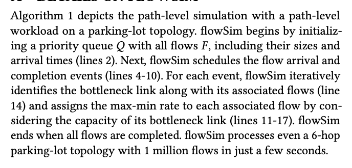
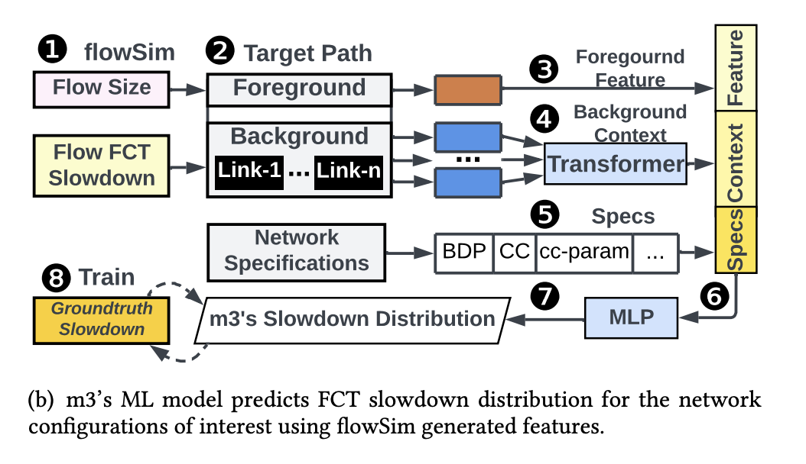

## topology-parkinglot 网络拓扑（cpp）
停车场拓扑是一种结构化的网络拓扑
+ 单层拓扑+双层拓扑
+ pl_ppf_from_array，迭代式拥塞控制算法
  + 计算链路负载
  + 寻找瓶颈链路
  + 更新数据流的传输速率


## workload基本结构（python）
+ workload 数据通常由多个流组成，每个流包含以下信息：
  + 源主机 (source host) 和 目标主机 (destination host)：流的起点和终点。
  + 流的大小 (flow size)：即流传输的数据量，通常以字节为单位。
  + 流的起始时间 (start time)：流开始传输的时间，通常以秒为单位。
+ 提供了自行生成流的脚本，可以根据读取特定流量分布的 CDF 文件来模拟其流量分布
  + 交换机到主机的链路比例
  + 流的数量
  + 带宽
  + 各条链路的相对带宽比例s

## flowsim
算法描述：描述了在停车场拓扑上的路径级别仿真。flowSim 通过初始化一个优先队列 𝑄，其中包含所有流 F，包括它们的大小和到达时间（见第 2 行）。接下来，flowSim 调度流的到达和完成事件（见第 4-10 行）。对于每个事件，flowSim 迭代地识别瓶颈链路及其关联的流（见第 14 行），并通过考虑瓶颈链路的容量，为每个关联流分配 max-min 速率（见第 11-17 行）。当所有流都完成时，flowSim 结束运行。flowSim 即使在一个 6 跳的停车场拓扑上处理 100 万条流量，也只需几秒钟 


为了在效率和精度之间取得平衡，m3 将 flowSim 的估计结果转化为简洁的特征图，如图 7(a) 所示。给定路径 \( P = (l_1, l_2, ..., l_n) \)，其中包含 \( n \) 条链路，以及一组前景流 \( F \)（图中的红色实线），特征图 \( M \) 表示为：

\[
M_s^F, P_p = \{ Sldn(f) \mid f \in F, size(f) \in buckets_s, percentile(f) = p \}
\]
其中，m3 首先根据每个流的大小将前景流分类到 s 个桶中。在每个桶 s 中，m3 记录 flowSim 预测的时延 (Sldn) ，并按 p 个固定百分位数计算。最终的特征图维度为𝑠×𝑝，如橙色矩形所示。默认情况下，特征图有 10 个流大小桶，范围从单个包不足 250B 的流到超过 50KB 的流，如图 3 所示。此外，它还包括 100 个固定百分位数，范围从 1% 到 100%，以 1% 的增量递增

前景流的性能还受到背景流的数量和特性（如图中的蓝色虚线所示）的影响。沿前景流路径上的每条链路，m3 为经过该链路的背景流生成类似的特征图（flowSim 计算的背景流 FCT 时延特征图，维度同为 𝑠×𝑝）。



### flowsim流程
**在每一轮中，找到当前最紧缺的资源（瓶颈链路），然后为瓶颈链路上的流分配一个尽可能高的速率r，使得链路上的所有流都能公平地使用带宽**
1.	初始化优先队列：
	+ flowSim 首先通过将所有流（包括其大小和到达时间）添加到优先队列 Q 中，来初始化事件队列（算法第 2 行）。
2.	动态流事件调度：
	+ 逐个处理事件队列中的事件。事件包括流的到达事件和完成事件。在处理每个事件时，flowSim 根据事件类型来进行相应的操作（算法第 4-10 行）。
	+ 如果是到达事件，flowSim 将新流添加到活动流集合 F* 中；如果是完成事件，则从 F* 中移除该流，并记录其完成时间。
3.	最大-最小公平速率分配：
	+ 对于每个事件，flowSim 会通过以下过程来分配最大-最小公平速率（算法第 11-17 行）：
	+ 初始化流速率集合 R* 和链路容量 C*。
	+	使用**迭代算法找到瓶颈链路**，并为瓶颈链路上的所有流分配最大-最小公平速率
	+	通过考虑瓶颈链路的容量来**为每个流更新速率**，确保所有流的速率分配是公平的。
	+	更新链路容量，并根据新的速率分配更新事件队列 Q，以便在下一个时间步使用。
4.	终止条件：
	+	当所有流都完成时，仿真结束。

### 主机对多路径版flowsim
#### 路径储存
如何储存路径？当前是通过很多映射
+ sd_to_sdid表示源-目标对的路径映射
+ sdid_to_linkid[][][up/down]表示在sdid对应的路径中，从源主机对其经过的第i条链路是多少
+ linkid_to_sdid[][][up/down]表示链路ID到源-目标对的映射，表示id为i的链路被sd_id为j的源-目标主机对在up/down中使用

考虑每一对源-目标主机对的所有路径，在储存时sd_to_sdid要多

**修改**
+ 在sd_to_sdid,linkid_to_sdid中添加一个维度，储存多路径
+ 维护一个从“每个源：目标主机对”到路径数目的映射
#### 流的分配策略（最大最小公平速率分配）
在每条路径上都进行速率分配，调用`pl_ppf_from_array`
修改
对于每一个活动流 f：
    对于 f 的每一条可用路径 p：
        计算路径 p 上的负载
        如果路径 p 的限制速率更小，则更新 min_rate_limit

问题：找瓶颈链路，分配速率

+ 数据结构
```cpp
struct {
    int path_count;
    int paths[MAX_PATHS][MAX_HOPS_PER_PATH]; //paths[i][j]表示链路中第i
} MultiPath;
```
+ 链路计算：用瓶颈带宽来表示某条链路的带宽？
+ 链路分配：对于某一条流，按照其所有可用路径的带宽比例进行分配？/直接平均分配？


## 流程
1. 输入：workload（每条流的id, source, destination, number of bytes, path）和topology
（与m3原本的逻辑不同）
2. 根据流数量加权采样若干条路径，并去重 (parsimon-eval/expts/fig_8/src/experiment.rs line437-459)
3. 对于每条路径进行枚举 (parsimon-eval/expts/fig_8/src/experiment.rs line461)
	+ 统计路径上的所有流 (parsimon-eval/expts/fig_8/src/experiment.rs line465-517)
	+ 调用mlsys模型 (parsimon-eval/expts/fig_8/src/experiment.rs line518-563, parsimon-eval/expts/fig_8/src/mlsys.rs line62-118)（**直接用run.c里的c代码**）
		+ 将流放入flowsim进行模拟计算 (clibs/run.c line1161-1172)
		+ 根据FCT和idea FCT计算slowdown(sldn) (clibs/run.c line1176-1211)
		+ 区分前景流和背景流，分别得到feature map (clibs/run.c line1231-1328)
		+ 调用transformer和mlp (clibs/run.c line1330-1363)


### 命令
cd parsimon/backends/High-Precision-Congestion-Control/simulation
CC='gcc-5' CXX='g++-5' CXXFLAGS='-std=c++11' ./waf configure --build-profile=optimized

cd parsimon/backends/High-Precision-Congestion-Control/gen_path
cargo run --release -- --python-path /users/ymy_yuan/anaconda3/envs/m3/bin/python --output-dir /users/ymy_yuan/m3/data


```cpp
./run ../ckpts/model_llama{model_suffix}.bin ../ckpts/model_mlp{model_suffix}.bin {data_dir} -b 10 -e 576 -n {n_hosts} -t 1 -f {bfsz} -k {window} -p {enable_pfc} -c {cc} -x {param_1} -y {param_2} > {data_dir}/output.txt 2>&1
```
+ n_hosts:path_length
+ bfsz:mix.bfsz
+ window:mix.window
+ enable_pfc:mix.enable_pfc
+ cc:mix.cc
+ param_1:mix.param_1
+ param_2:mix.param_2


```cpp
cd /users/ymy_yuan/m3/parsimon-eval/expts/fig_8/src

./run /users/ymy_yuan/m3/ckpts/model_llama.bin /users/ymy_yuan/m3/ckpts/model_mlp.bin /users/ymy_yuan/m3/parsimon-eval/expts/fig_8/data -b 10 -e 576 -t 1 -f 40.0 -k 16515 -p 1.0 -c dctcp -x 10.842025307341636 -y 0.0


g++ -fsanitize=address -g my_build.cpp my_lib.cpp topo.c -o run
gdb ./run
set args /users/ymy_yuan/m3/ckpts/model_llama.bin /users/ymy_yuan/m3/ckpts/model_mlp.bin /users/ymy_yuan/m3/parsimon-eval/expts/fig_8/data -b 10 -e 576 -t 1 -f 40.0 -k 16515 -p 1.0 -c dctcp -x 10.842025307341636 -y 0.0
run
```


python main_train.py --train_config=/users/ymy_yuan/m3/config/train_config_path.yaml --mode=train --dir_input=/users/ymy_yuan/m3/data --dir_output=/users/ymy_yuan/m3/ckpts


python main_train.py --train_config=/users/ymy_yuan/m3/config/train_config_path_demo.yaml --mode=train --dir_input=/users/ymy_yuan/m3/data --dir_output=/users/ymy_yuan/true_m3/ckpts


print(sizebucket_to_sldn_est.add_(-1.0))
print(sizebucket_to_sldn_est)
print(sizebucket_to_sldn)

 
## 项目目录结构

- **ckpts**  
  用于存放Llama-2和2层MLP的检查点文件，这些文件在m3中使用。

- **clibs**  
  用于运行m3中的路径级模拟的C语言库。

- **config**  
  包含用于训练和测试m3的配置文件。

- **parsimon**  
  包含Parsimon和m3的核心功能。
  - **backends**
    - **High-Precision-Congestion-Control**  
      HPCC（高精度拥塞控制）库，用于数据生成。
****
- **parsimon-eval**  
  包含重现m3实验及其对比实验的脚本。

- **util**  
  包含m3的实用函数，包括数据加载器和机器学习模型的实现。

- **gen_ckpts.py**  
  用于生成m3检查点的脚本。

- **main_train.py**  
  用于训练和测试m3的主脚本。


### 模型过程
#### 构建datamodule
1. 在训练模式下，循环遍历 shard、流量数量、主机数量，并生成仿真工作负载的不同组合。最后**打乱**，作为**data_list**
2. setup,设置训练/测试的数据集
   + 如果是训练模式，则将data_list分为训练集和验证集
   + 如果是测试模式，则根据经验数据生成测试集
3. get_item,获取数据集中的一个样本


#### 训练模型FlowSimTransformer_Path
trainer.fit(model, datamodule)
1. 准备数据
  + setup(stage="fit")
  + train_dataloader()
2. 初始化模型
3. 训练循环
  + 每个epoch都会调用training_step
  + 每个epoch结束时，会调用validation_step
4. 回调


#### 参数


base-line:
Epoch 499: 100%|███████████████████████████████| 22/22 [00:07<00:00,  3.10it/s, v_num=3, train_loss_sync_step=0.0316, val_loss_sync_step=0.227, val_loss_sync_epoch=0.400, train_loss_sync_epoch=0.0288]


train_frac: 0.9
Epoch 499: 100%|█████████████████████| 22/22 [00:07<00:00,  2.99it/s, v_num=6, train_loss_sync_step=0.0538, val_loss_sync_step=0.516, val_loss_sync_epoch=1.040, train_loss_sync_epoch=0.0769]


train_frac: 0.95(comment out the in-place add operation)
Epoch 499: 100%|████████████████████████████████████| 23/23 [00:07<00:00,  3.10it/s, v_num=1, train_loss_sync_step=0.0536, val_loss_sync_step=0.584, val_loss_sync_epoch=0.545, train_loss_sync_epoch=0.0832]